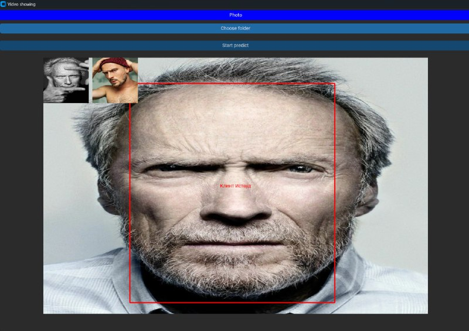

# UfaHack2024

Хакатон UfaHack2024 в Уфе

---

## Описание проекта
Проект представляет систему распознавания лиц актёров (США / СССР-Россия) и блогеров с веб-камеры и по загруженным фотографиям. Пайплайн обработки: MTCNN (детекция лица) → DeepFace (Facenet, выделение эмбеддингов) → CatBoost (градиентный бустинг, классификация).

На основе десктопного приложения на CustomTkinter пользователь может запускать распознавание как из файловой папки с фотографиями, так и в реальном времени через веб-камеру. Дополнительно реализован Android-клиент на Kotlin, который отправляет фото на серверную часть по TCP-сокету.

Система обучена на нескольких категориях: актёры США, актёры СССР-Россия и блогеры. Для каждой категории строится отдельная модель CatBoost, использующая эмбеддинги лиц, извлечённые предобученной сетью Facenet.

## Стек технологий
- Python (основной язык)
- CustomTkinter (графический интерфейс)
- DeepFace + Facenet (извлечение эмбеддингов лиц)
- MTCNN / FastMTCNN (детекция лиц)
- CatBoost (градиентный бустинг)
- OpenCV + opencv-contrib-python (обработка изображений и видео)
- PyTorch + torchvision (фреймворк для нейросетей)
- CUDA (ускорение на GPU)
- Kotlin (Android-клиент)

## Структура проекта
```
UfaHack2024/
├── notebooks/
│   ├── app/
│   │   ├── main.py               # Точка входа, CustomTkinter
│   │   ├── Predict_photo.py      # Распознавание из папки с фото
│   │   ├── Predict_video.py      # Распознавание с веб-камеры
│   │   ├── PredictServer.py      # TCP-сервер (192.168.120.240:12345)
│   │   ├── Start.py              # Стартовое окно
│   │   ├── FastMtcnn.py          # Ускоренный MTCNN
│   │   └── FDJ.jpg               # Тестовое изображение
│   ├── model/
│   │   ├── saved_dictionary.pkl          # Словарь имён (категория)
│   │   ├── saved_dictionary_russia.pkl   # Словарь имён (Россия)
│   │   ├── saved_dictionary_bloggers.pkl # Словарь имён (блогеры)
│   │   ├── actors_usa_embeddings.pkl     # Эмбеддинги (США)
│   │   └── actors_ussr_embeddings.pkl    # Эмбеддинги (СССР-Россия)
│   ├── saved_dictionary.pkl      # Словарь имён (корневой)
│   ├── EDA.ipynb                 # Разведочный анализ данных
│   ├── blur_detection.ipynb      # Детекция размытия
│   ├── catboost.ipynb            # Обучение CatBoost
│   ├── deepface_notebooks.ipynb  # Работа с DeepFace
│   ├── FastMTCNN.py              # Вспомогательный модуль
│   └── tester.py                 # Тестирование
├── MyApplication6.rar            # Android-клиент (Kotlin)
├── .gitignore
├── requirements.txt
└── c4715817-515e-4815-aa0d-bfcc75d45388.jfif
```

## Установка и запуск

1. Клонируйте репозиторий:
```
git clone https://github.com/DrHo1y/UfaHack2024.git
cd UfaHack2024
cd notebooks/app
```
2. Установите зависимости (см. раздел Зависимости ниже).
3. Запустите приложение:
```
python main.py
```

### Зависимости
Файл `requirements.txt` содержит лишь часть зависимостей (deepface, customtkinter, torch, torchvision). Для полной работы дополнительно установите:
- catboost
- opencv-python
- opencv-contrib-python
- pandas
- imutils
- mtcnn

Базовую установку можно выполнить командой:
```
pip install -r requirements.txt
```
Затем доустановите недостающие пакеты из списка выше.

## Важные замечания
- Файлы `.cbm` (catboost_usa.cbm, catboost_ussr.cbm) **не включены** в репозиторий. Их необходимо обучить из блокнота `catboost.ipynb` или получить отдельно.
- Каталоги `data/` с фотографиями находятся в `.gitignore` и **не приложены** к репозиторию. В коде жёстко прописаны абсолютные пути вида `C://Users//fatik//PycharmProjects//UfaHack2024//data//...` — перед запуском требуется скорректировать пути под ваше окружение.
- `requirements.txt` неполон; список установки недостающих пакетов приведён выше.
- Серверная часть (`PredictServer.py`) ожидает IP-адрес `192.168.120.240:12345` — измените под свою сеть.

## Приложение для Android
В корне репозитория находится архив `MyApplication6.rar` — проект Android-приложения на Kotlin. Клиент подключается к серверу (`PredictServer.py`) по TCP-сокету, отправляет фотографию и получает результат распознавания.

## Благодарности
Для обучения модели использовали [CatBoost](https://catboost.ai/)